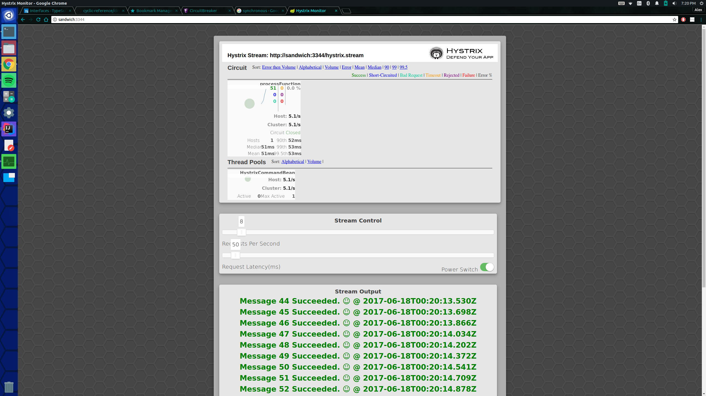

# CIRCUIT BREAKER DEMOSTRATION

#### Welcome to this project!

---

I would first like to explain what the heck this collection of code tries to accomplish.
This tries to demonstrate the [circuit-breaker](https://martinfowler.com/bliki/CircuitBreaker.html) pattern implmented by Netflix as [Hystrix](https://github.com/Netflix/Hystrix).
Hystrix's main use case, is to prevent execution of code that invokes unreliable services or hardware.
Things that are prone to timeouts, crashing under high load, low availablity, and the list can go on and on.
In general, Hystrix was made to protect your code for everybody else.
It also has the ability to notify when code, wrapped in a Hystrix circuit breaker, has opened the circuit and is sending canned responses or failiure, for each invokation.
Effectively re-routing all traffic away from the area that has failed.

What I have created is a constant stream of data that is piplined to the front-end application. 
The fun part is that part of the stream is routed through a trouble-maker.
The trouble maker can be in a state where all invocations throw an exception. 
In addition to being alway blowing up, the trouble maker can also have variable latency.
Meaning invocation time of the trouble maker's method can vary.

This is all done to allow simulation of a shoddy third party service. 
Code that is not mine, but can affect how my code performs. 
Effectively making us look bad.

So all invocations are wrapped in a Hystrix Command.
In an attempt to demonstrate some of the functionality the circuit-breaker API provides.
The state of the HystrixCommand and HystrixThreadPool, will be displayed in the Hystrix Dashboard.

There are three controls:
    
1. Number of Requests synchronously queued to execute.
1. How long each synchronous request will take.
1. Whether or not each invocation will throw an exception.

As an example if the number of requests is set to 50 requests per second, and request latency is set to 500ms per request.
All you are really going to get is 2 requests per second.

Also, the application tries to replicate sessions. So you can have more than one tab open and each message stream should be unique.
I have noticed some odd quirks with chrome and not wanting to make http requests when the application is open in more than one tab in chrome. :|

For more information about Circuit breakers be sure to [checkout my post](http://blog.acari.io/2017/06/18/Circuit-Breakers.html)!

---

#### Bare Minimum, to run the sample you will need:
 - Internet Connection (At least the first time it is run)
 - [Java 8 runtime](http://blog.acari.io/jvm/2017/05/05/Gradle-Install.html)
 - [Gradle 2.3+ ](http://blog.acari.io/jvm/2017/05/05/Gradle-Install.html)
 
To run any server in this repository just do the following.
1. Open a command line with the hystrix-sample as the current working directory.
1. Run 'gradle bootRun'.

This will start a Spring Boot server running on port 3344, so accessing the application is as simple as going to 

    http://localhost:3344/
    
Which should yield something like this:

So the repository has the production ready code already checked into the static resources directory of the Spring Boot project.
Which is handy if modifying the front-end code is not necessary.
However if that is something that sounds like up your alley, things you will need:

- An internet connection
- At least node 6.9.x and npm 3.x.x. (Would highly recommend using the [node docker image](https://hub.docker.com/_/node/))

All of the front end code is stored in the angular4 directory.
The frontend code lifecycle is managed by some node commands.

- Dependency management during packaging is managed by webpack, which can be run by the command `npm run build`.
Running this command will transpile the code, package it and move all of the new files into circuit-breaker/hystrix-sample/src/main/resources/static.
- Typescript transpiling is managed by `npm run compile`
- The lint process is run by `npm run lint`, which is currently not part of the build process, but can be run separatly.
- Live code changes can be visualized by browser sync and webpack watch, which can be started by `npm run watch`. 

If installing node on your local machine does not tickle your fancy, here is how docker can be used to manage the application lifecycle.

For starters, you can use my node image that extends the official node image, but also creates a app directory at the root, which will be handy for mounting the code onto.

Accessing the image is as simple as 
    
    sudo docker pull alexsimons/node

After the image has downloaded, running the following commands should look something like this:

    sudo docker run --rm -i -t  -v /home/alex/workspace/circuit-breaker/hystrix-sample/:/app alexsimons/node npm run lint   
    
This tells docker to start a container, with the hystrix-sample directory mounted on the app directory (your path will vary but the `/app` will remain the same). 
In addition, when the container finishes running the `npm run lint` command docker will remove the inactive container.
The `-i -t` tells docker to attach to the running container and run a [tty](http://www.abouttty.com/), respectively. 

The only goof in using docker is when you want to use the watch functionality. 
I had to create a proxy to localhost:3344 to get around cross-origin requests (CORS), rather than setting CORS headers.
Since docker containers are really there own thing, its localhost is not the same as the docker host's localhost (your machine).
So the proxy has to be reconfigured from localhost:3344 to your ip and port 3344.
This configuration is located in the **webpack.config.js** file on line 12.
After configuration all you have to do is run the equivalent command: 

    sudo docker run --rm -i -t  -v /home/alex/workspace/circuit-breaker/hystrix-sample/:/app alexsimons/node npm run watch
       
Enjoy!

-Alex